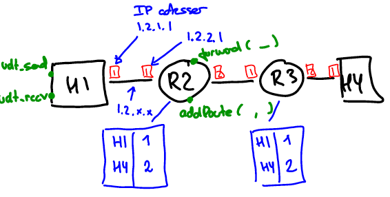
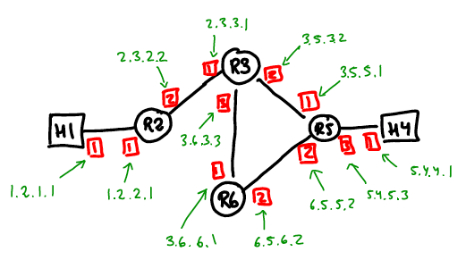

### Network Layer Routing Framework (NRF)

The NRF framework is an implementation in Java of a virtual network layer that makes it possible to experiment with the control- and dataplane of the network layer, including the functionality of addressing, network interfaces, routes, datagram forwarding, forwarding tables, and routing algorithms.

#### Exercise 1 - Getting started and cloning the framework

For an introduction to the basic concepts of the NRF framework you should watch the video:

- *Introduction to the Network Routing Framework (NRF)* available from Canvas under "Emnets mediafiler"

For an introduction to the implementation you should watch the video:

- *Demonstration of the Network Routing Framework (NRF)* available from Canvas under "Emnets mediafiler"

The NRF framework is organised into two git-repositories located at:

- https://github.com/lmkr/dat110-nrf.git (framework implementation)
- https://github.com/lmkr/dat110-nrt-exercises.git (example networks and tests)

Clone the two repositories and import the corresponding Java projects into your IDE.

#### Exercise 2 - Testing an example network

The package `no.hvl.dat110.nrf.staticrouting` in the `dat110-nrf-exercises` project contains several examples of networks with hosts and routers. In this exercise you will consider the network in the class `SimpleNetwork.java` comprised of two hosts connected by two routers. This is the example that was considered in the introduction video:

Select the class `SimpleNetwork.java` (which constitute a unit-test) and run it as a unit test. The test will send a datagram through the network from H1 to H4 and a datagram from H4 to H1 and then check that the datagram is being correctly received at the destination.

Observe the output in the console. Which route through the network does a datagram follow from host H1 to host H4, and from host H4 to host H1.

#### Exercise 3 - Augment the example network

Augment the network simple network from exercise 2 such that it now has the topology shown in the figure below. The labels indicate the IP address to be configured for each of the interfaces of the hosts and routers.

Remember that you also have to add routes to the routers R2-R6 such that datagrams can be transmitted between host H1 and host H4.

Run the test sending datagrams between H1 and H4 and check that datagrams are correctly routed between H1 and H4.

Try to modify the routes such that a datagram from H1 to H4 is send via R2, R3, R5 while a datagram from H4 to H1 is sent via R5, R6, R4, and R3.

#### Exercise 4 - Routing loops and hop count

Misconfiguration of a forwarding table may result in routing-loops where a datagrams keeps being routing along a cycle in the network and never reaches its destination.

Modify the routes configured for the network in Exercise 3 such that a datagram from H1 to H4 will keep being forwarding in a loop comprises of routers R3, R5, R6, R3. Does the datagram reach its destination?

To detect such situation, IP datagrams are equipped with a *hop-count* (time-to-live) value in its header which is decremented each time the datagram is being forwarded by a router.

Augment the class `Datagram.java` such that datagram now also carries a hop count. This hop count should be set to *10* when a hosts sends the datagrams and decremented each time a router forwards the datagram. If a router receives a datagram with a hop count of 0, then it should discard the datagram.

The forwarding of datagram in NRF is implemented in the `forward`-method of the `Router.java` class.

#### Exercise 5 - Routing errors and control messages

A better solution to routing loops than just discarding the datagram is to send a message to the source of the datagram, i.e., the host that send the datagram. This is one of the roles of the Internet Control Message Protocol (ICMP).

Augment the NRF framework such that if a router detects a datagram with a hop count of 0, then it will send an ICMP message back to the source host indicating that the hop-count limit was reached.

#### Exercise 6 - Longest Prefix Matching

Modify the implementation of NRF such that network prefixes can be used in the routing tables and such that longest prefix matching is being used to find the entry in the forwarding table that determines on which interface a datagram is being forwarded.

#### Exercise 7 - Implementation of link-state routing algorithm

** EXERCISE TODO **

#### Exercise 8 - Implementation of distance-veector routing algorithm

** EXERCISE TODO **
